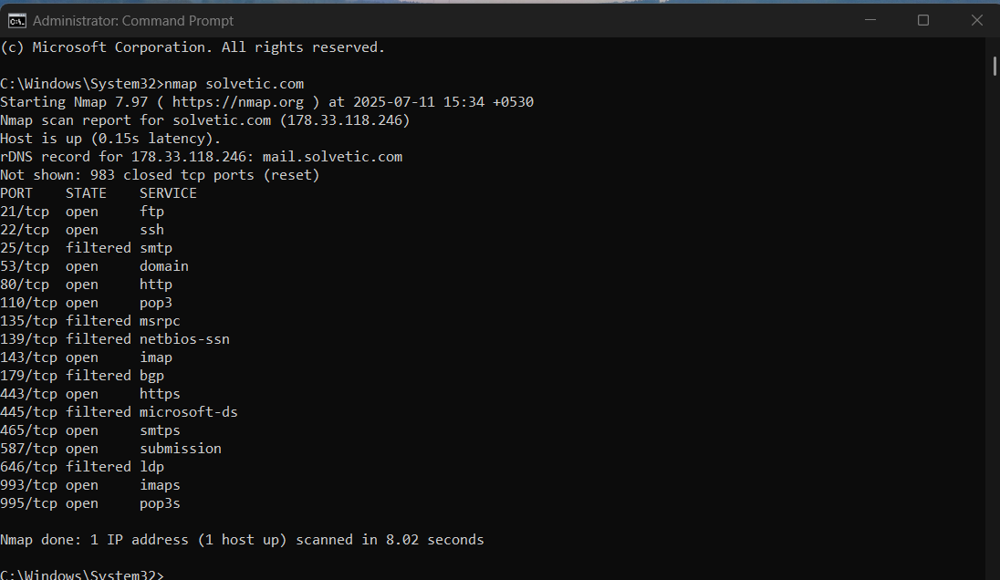

# Nmap Scan Results for solvetic.com

## Objective
Perform a basic Nmap version scan to identify open ports and running services on the host `solvetic.com`.

---

## Command Used
```bash
nmap -sV solvetic.com
```

---

## Summary of Results

| Port | State     | Service        | Version                                  |
|------|-----------|----------------|------------------------------------------|
| 21   | open      | ftp            | Pure-FTPd                                |
| 22   | open      | ssh            | OpenSSH 5.3 (protocol 2.0)               |
| 25   | open      | smtp           |                                          |
| 53   | open      | domain         | ISC BIND 9.8.2rc1 (RedHat Enterprise 6)  |
| 80   | open      | http           | Apache httpd                             |
| 110  | open      | pop3           | Dovecot pop3d                            |
| 135  | filtered  | msrpc          |                                          |
| 139  | filtered  | netbios-ssn    |                                          |
| 143  | open      | imap           | Dovecot imapd                            |
| 179  | filtered  | bgp            |                                          |
| 443  | open      | ssl/http       | Apache httpd                             |
| 445  | filtered  | microsoft-ds   |                                          |
| 465  | open      | ssl/smtp?      |                                          |
| 587  | open      | submission?    |                                          |
| 636  | filtered  | ldap           |                                          |
| 993  | open      | imaps?         | Unknown service fingerprint              |
| 995  | open      | pop3s?         | Unknown service fingerprint              |

---

## Screenshot


---

## ℹHost Information
- **IP Address**: 178.33.118.246
- **Reverse DNS**: mail.solvetic.com
- **Operating System**: RedHat Enterprise Linux 6

---

## Notes
- Some ports returned unrecognized service fingerprints.
- You may report unknown services to Nmap for better detection: https://nmap.org/cgi-bin/submit.cgi?new-service
- This scan helps identify active services and potential vulnerabilities on the target host.
